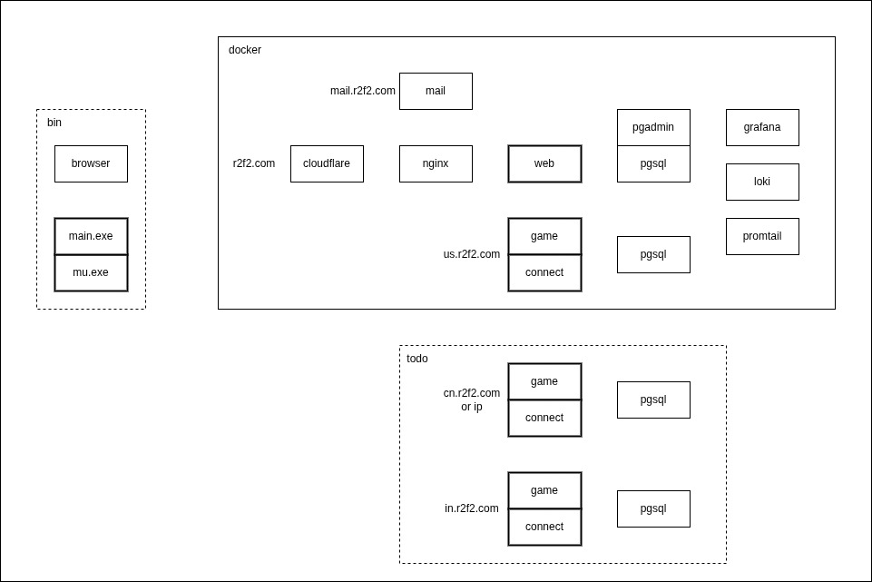

## Deploy



## ~~Use UFW~~

### 1. iptables

```
# add config to /etc/docker/daemon.json and systemctl restart docker
{
    "iptables": false
}
./iptables-ufw.sh
./ufw.sh
```

### 2. make it persistent

```
sudo cp iptables-ufw-boot.service /etc/systemd/system
sudo systemctl daemon-reload
sudo systemctl enable iptables-ufw-boot.service
```

## Use Docker iptables

```
    ┌────────────────────────────────────────────────────────────────────┐
    │                                                                    │
    │                                                                    │
    │  ┌─────────────► PREROUTING                              INPUT ────┼─────────┐
    │  │                   │                                     ▲       │         │
    │  │                   │                                     │       │         │
    │  │                   │                                     │       │         │
    │  │                   │            ┌─────────┐              │       │         │
    │  │                   └──────────► │ Routing │ ─────────────┘       │         |
    │                                   │         │                      │         ▼
interfaces                 ┌─────────── │ decision│ ◄────────────┐       │    Local Process
 ▲  │                      │            └────┬────┘              │       │         │
 │  │                      │                 │                   │       │         │
 │  │                      │                 │                   │       │         │
 │  │                      │                 │                   │       │         │
 │  │                      │                 ▼                   │       │         │
 │  │                      │              FORWARD                │       │         │
 │  │                      │                 │                   │       │         │
 │  │                      ▼                 │                           │         │
 └──┼───────────────── POSTROUTING ◄─────────┘                 OUTPUT ◄──┼─────────┘
    │                                                                    │
    │                                                                    │
    └────────────────────────────────────────────────────────────────────┘
```

### 1. iptables

```
./iptables-docker.sh
```

### 2. make it persistent

```
sudo cp iptables-docker-boot.service /etc/systemd/system
sudo systemctl daemon-reload
sudo systemctl enable iptables-docker-boot.service
```
