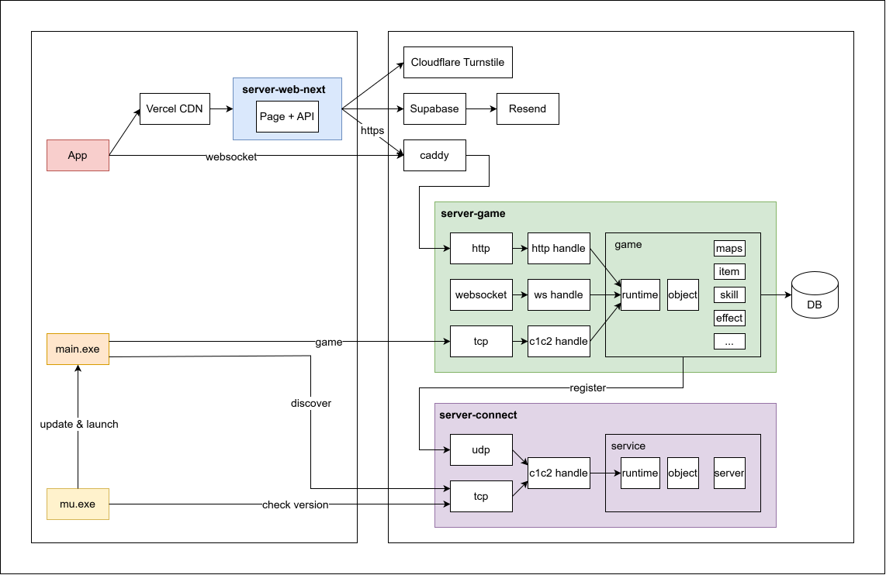

## System

## Specification

- [Auto update](auto-update.md)

- [Server list](server-list.md)

- [Account](account.md)

- [Character](character.md)

- [Object](object.md)

- [Item](item.md)

- [Skill](skill.md)

- [Effect](effect.md)
