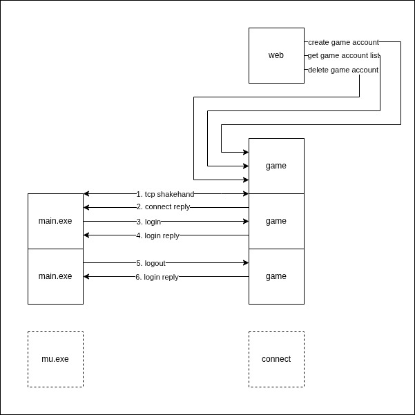

## Account



### New game account

#### Request

Post /accounts

```
{
    "name": "abc",
    "password": "123",
    "user_id": "2"
}
```

#### Reply

Code: 200

```
{
    "id": "1",
    "name": "abc",
    "user_id": "2"
}
```

Code: 500

```
{
    "message": "error reason"
}
```

### Get game account list

#### Request

Get /accounts?user_id=2

#### Reply

Code: 200

```
[
    {
        "id": "1"
        "name": "abc",
        "user_id": "2"
    },
    {
        "id": "2"
        "name": "def",
        "user_id": "2"
    }
]

```

Code: 500

```
{
    "message": "error reason"
}
```

### Delete game account

#### Request

Delete /accounts/:id

#### Reply

Code: 200

```
{}
```

Code: 500

```
{
    "message": "error reason"
}
```

### Connect

TCP shakehand

#### Request

null

#### Reply

```
pack(1)
[C1 0F F1 00 01 2E 7C 30 2E 31 2E 35 00 00 00]
```

| Index | Element | Description                         |
| ----- | ------- | ----------------------------------- |
| 0     | 0xC1    | c1c2 frame flag                     |
| 1     | 0x0F    | c1c2 frame size                     |
| 2     | 0xF1    | c1c2 frame code 0xF100 BE high byte |
| 3     | 0x00    | c1c2 frame code 0xF100 BE low byte  |
| 4     | 0x01    | connect result: 0=failed 1=success  |
| 5     | 0x2E    | player index 0x2E7C BE high byte    |
| 6     | 0x7C    | player index 0x2E7C BE low byte     |
| 7~14  | byte[8] | client version                      |

Or reply with login failed for player count limit:

```
pack(1)
[C1 05 F1 01 04]
```

| Index | Element | Description                         |
| ----- | ------- | ----------------------------------- |
| 0     | 0xC1    | c1c2 frame flag                     |
| 1     | 0x05    | c1c2 frame size                     |
| 2     | 0xF1    | c1c2 frame code 0xF101 BE high byte |
| 3     | 0x01    | c1c2 frame code 0xF101 BE low byte  |
| 4     | 0x04    | login result is 0x04                |

### Login

Player login

#### Request

```
pack(1)
[C1 A2 F1 01 name[10] password[20] hid[100] 67 5B 08 00 version[8] serial[16]]
```

| Index   | Element   | Description                         |
| ------- | --------- | ----------------------------------- |
| 0       | 0xC1      | c1c2 frame flag                     |
| 1       | 0xA2      | c1c2 frame size                     |
| 2       | 0xF1      | c1c2 frame code 0xF101 BE high byte |
| 3       | 0x01      | c1c2 frame code 0xF101 BE low byte  |
| 4~13    | byte[10]  | account name with xor               |
| 14~33   | byte[20]  | account password with xor           |
| 34~133  | byte[100] | hardware id                         |
| 134     | 0x67      | client tickcount 0x00085B67 LE      |
| 135     | 0x5B      | client tickcount 0x00085B67 LE      |
| 136     | 0x08      | client tickcount 0x00085B67 LE      |
| 137     | 0x00      | client tickcount 0x00085B67 LE      |
| 138~145 | byte[8]   | client version                      |
| 146~161 | byte[16]  | client serial                       |

#### Reply

```
pack(1)
[C1 05 F1 01 01]
```

| Index | Element | Description                         |
| ----- | ------- | ----------------------------------- |
| 0     | 0xC1    | c1c2 frame flag                     |
| 1     | 0x05    | c1c2 frame size                     |
| 2     | 0xF1    | c1c2 frame code 0xF101 BE high byte |
| 3     | 0x01    | c1c2 frame code 0xF101 BE low byte  |
| 4     | 0x01    | login result                        |

```
0: password doesn't match 密码错误
1: success
2: account doesn't exist 账号错误
3: already online 该账号正在使用中
4: player count limit 本服务器可容纳的人数已满
5: machine id banned 客服提示：该账号目前被禁止使用
6: version unmatched 您的游戏版本不对，请到官方网站下载最新的版本
8: login counts exceeded 3 失败 3 次连接中断
9: 没有付款信息
10: 本账号的使用期限已到期
11: 本账号的储值点数不足
12: 这个 IP 的使用期限已到期
13: 这个 IP 的储值点数不足
17: 是 15 岁以上能够使用的服务器
64: non-vip 未购买收费服务器入场券而无法进入
```

### Logout

Player logout

#### Request

```
pack(1)
[C1 05 F1 02 02]
```

| Index | Element | Description                         |
| ----- | ------- | ----------------------------------- |
| 0     | 0xC1    | c1c2 frame flag                     |
| 1     | 0x05    | c1c2 frame size                     |
| 2     | 0xF1    | c1c2 frame code 0xF102 BE high byte |
| 3     | 0x02    | c1c2 frame code 0xF102 BE low byte  |
| 4     | 0x02    | flag                                |

```
flag:
0=close game
1=back to pick character
2=back to pick server
```

#### Reply

```
pack(1)
[C1 05 F1 02 02]
need Encrypt
```

| Index | Element | Description                         |
| ----- | ------- | ----------------------------------- |
| 0     | 0xC1    | c1c2 frame flag                     |
| 1     | 0x05    | c1c2 frame size                     |
| 2     | 0xF1    | c1c2 frame code 0xF102 BE high byte |
| 3     | 0x02    | c1c2 frame code 0xF102 BE low byte  |
| 4     | 0x02    | flag                                |

```
flag:
0=close game
1=back to pick character
2=back to pick server
```
