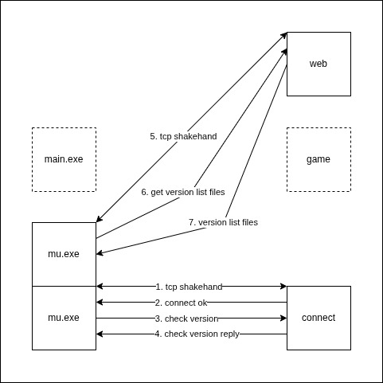

## Auto Update



### Check version

#### Request

```
pack(1)
[C1 06 04 00 01 05]
```

| Index | Element | Description          |
| ----- | ------- | -------------------- |
| 0     | 0xC1    | c1c2 frame flag      |
| 1     | 0x06    | c1c2 frame size      |
| 2     | 0xF4    | c1c2 frame code 0x04 |
| 3     | 0x00    | client version major |
| 4     | 0x01    | client version minor |
| 5     | 0x05    | client version patch |

#### Reply

version matched

```
[C1 04 02 01]
```

| Index | Element | Description                          |
| ----- | ------- | ------------------------------------ |
| 0     | 0xC1    | c1c2 frame flag                      |
| 1     | 0x04    | c1c2 frame size                      |
| 2     | 0x02    | c1c2 frame code 0x02 version matched |
| 3     | 0x01    | result                               |

version unmatched

```
pack(1)
[C1 A8 04 00 01 06 host[100] port login[20] passwd[20] file[20]]
```

| Index   | Element    | Description                                          |
| ------- | ---------- | ---------------------------------------------------- |
| 0       | 0xC1       | c1c2 frame flag                                      |
| 1       | 0xA8       | c1c2 frame size                                      |
| 2       | 0x04       | c1c2 frame code 0x04 version unmatched               |
| 3       | 0x00       | server version major                                 |
| 4       | 0x01       | server version minor                                 |
| 5       | 0x06       | server version patch                                 |
| 6~105   | host[100]  | host 100 bytes padding extra bytes with 0x00         |
| 106     | 0x15       | ftp port 21(0x0015) LE low byte                      |
| 107     | 0x00       | ftp port 21(0x0015) LE high byte                     |
| 108~127 | login[20]  | login 20 bytes padding extra bytes with 0x00         |
| 128~147 | passwd[20] | passwd 20 bytes padding extra bytes with 0x00        |
| 148~167 | file[20]   | tags.wvd file 20 bytes padding extra bytes with 0x00 |

### Patches

https://forum.ragezone.com/threads/make-your-own-muautoupdater.183456

```
patches/
├── 0.1.5
│   ├── list.inf
│   ├── up_list
│   │   └── config.ini
│   └── up_list.zip
└── tags.wvd
```

1, tags.wvd (NOTE: CRLF)

```
"0.1.4"
"0.1.5"
```

2, list.inf (NOTE: CRLF)

```
#COMPRESSED#
#PACKINGVERSION#
"config.ini"
```

or

```
#COMPRESSED#
#PACKINGVERSION#
"config.ini"
"main.dll"
```

or

```
#COMPRESSED#
#PACKINGVERSION#
"config.ini"
"main.dll"

0 "Data"

0 "Data\Interface"
"dungeun.ozt"
"tarcan.ozt"

0 "Data\Local"
"Dialog.bmd"
"everyone.ozj"
"Filter.bmd"
"FilterName.bmd"
"item.bmd"
"itemsetoption.bmd"
"itemsettype.bmd"
"Loading01.OZJ"
"Loading02.OZJ"
"Loading03.OZJ"
"movereq.bmd"
"NpcName(Eng).txt"
"quest.bmd"
"Skill.bmd"
"slide.bmd"
"Text.bmd"
"webzenlogo.OZJ"
"webzenlogo02.OZJ"
```

3, config.ini (NOTE: CRLF)

```
[LOGIN]
Version=0.1.5
TestVersion=1.00.05
[PARTITION]
Version=381
```

NOTE: The orginal client config.ini should be:

```
[LOGIN]
Version=0.1.4
TestVersion=1.00.05
[PARTITION]
Version=381
```

4, zip up_list

```
zip -rj up_list.zip up_list
```

### Problems

1, MU.exe didn't send http request to web every time, even though the version is unmatched.

Disable cache.  
https://stackoverflow.com/questions/40243633/disable-nginx-cache-for-javascript-files

2, MU.exe didn't get specific tag from web to update after got the tags.wvd.

The current version tag must be lower than new version tag.

3, MU.exe always create a new tcp connection without reusing or closing the old tcp connection.
