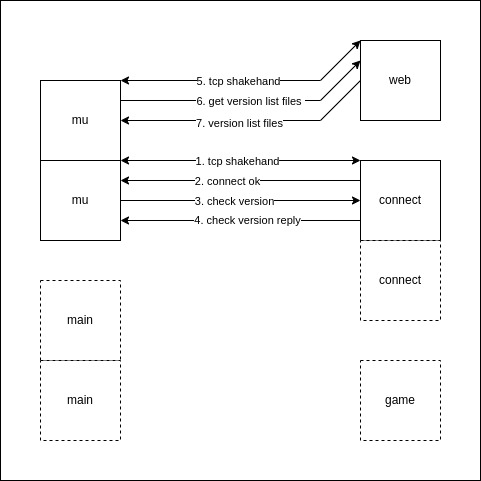

## Auto Update



### patches

http://muonlineworlds.blogspot.com/2015/01/well-this-time-i-will-show-you-how-to.html

```
patches/
├── 0.1.5
│   ├── list.inf
│   ├── up_list
│   │   └── config.ini
│   └── up_list.zip
└── tags.wvd
```

1, tags.wvd (NOTE: CRLF)

```
"1.04.44"
"0.1.5"
```

2, list.inf (NOTE: CRLF)

```
#COMPRESSED#
#PACKINGVERSION#
"config.ini"
```

or

```
#COMPRESSED#
#PACKINGVERSION#
"config.ini"
"main.dll"
```

or

```
#COMPRESSED#
#PACKINGVERSION#
"config.ini"
"main.dll"

0 "Data"

0 "Data\Interface"
"dungeun.ozt"
"tarcan.ozt"

0 "Data\Local"
"Dialog.bmd"
"everyone.ozj"
"Filter.bmd"
"FilterName.bmd"
"item.bmd"
"itemsetoption.bmd"
"itemsettype.bmd"
"Loading01.OZJ"
"Loading02.OZJ"
"Loading03.OZJ"
"movereq.bmd"
"NpcName(Eng).txt"
"quest.bmd"
"Skill.bmd"
"slide.bmd"
"Text.bmd"
"webzenlogo.OZJ"
"webzenlogo02.OZJ"
```

3, config.ini (NOTE: CRLF)

```
[LOGIN]
Version=0.1.5
TestVersion=1.00.05
[PARTITION]
Version=381
```

4, zip up_list

```
zip -rj up_list.zip up_list
```

### problems

1, MU.exe didn't send http request to web every time, even though the version is unmatched.

2, MU.exe didn't get specific tag from web to update after got the tags.wvd.

3, MU.exe would create a new tcp connection without reusing or closing the old tcp connection.
