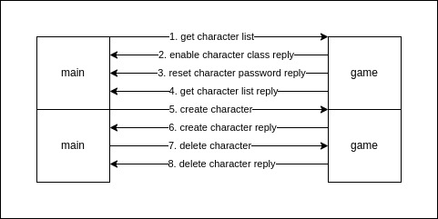

## Character



### Get character list

#### Request

```
[C1 04 F3 00]
```

| Index | Element | Description                         |
| ----- | ------- | ----------------------------------- |
| 0     | 0xC1    | c1c2 frame flag                     |
| 1     | 0x04    | c1c2 frame size                     |
| 2     | 0xF3    | c1c2 frame code 0xF300 BE high byte |
| 3     | 0x00    | c1c2 frame code 0xF300 BE low byte  |

#### Reply

```
[C1 05 DE 00 1F]
```

| Index | Element | Description                         |
| ----- | ------- | ----------------------------------- |
| 0     | 0xC1    | c1c2 frame flag                     |
| 1     | 0x05    | c1c2 frame size                     |
| 2     | 0xDE    | c1c2 frame code 0xF300 BE high byte |
| 3     | 0x00    | c1c2 frame code 0xF300 BE low byte  |
| 4     | 0x1F    | enable character class              |

```
character class:
0x01 - Summoner
0x02 - DarkLord
0x04 - Magumsa
0x08 - RageFighter
0x10 - GrowLancer
```

#### Reply

```
[C1 1C F3 00 1F 00 01 01 byte[36]]
```

| Index | Element  | Description                          |
| ----- | -------- | ------------------------------------ |
| 0     | 0xC1     | c1c2 frame flag                      |
| 1     | 0x1C     | c1c2 frame size                      |
| 2     | 0xF3     | c1c2 frame code 0xF300 BE high byte  |
| 3     | 0x00     | c1c2 frame code 0xF300 BE low byte   |
| 4     | 0x1F     | enable character class               |
| 5     | 0x00     | move count                           |
| 6     | 0x01     | character list count                 |
| 7     | 0x01     | warehouse expansion flag: 0=no 1=yes |
| 8~43  | [36]byte | character information                |

| Index | Element  | Character Description      |
| ----- | -------- | -------------------------- |
| 0     | 0x00     | index: 0~4                 |
| 1~10  | [10]byte | name                       |
| 11    | 0x00     | padding for alignment in C |
| 12    | 0x01     | level 0x0001 LE low byte   |
| 13    | 0x00     | level 0x0001 LE high byte  |
| 14    | 0x00     | ctlcode                    |
| 15~32 | byte[18] | character encode           |
| 33    | 0xFF     | guild status               |
| 34    | 0x00     | pk level                   |
| 35    | 0x00     | padding for alignment in C |

```
class -> chars[0] bit5~bit7: 0~7 bit3~bit4: 2=changeup1 3=changeup2

slot0~slot6 index -> chars[1]~chars[5]
slot0~slot6 index extention1 -> chars[9] bit3~bit7
slot0~slot6 index extention2 -> chars[12]~chars[15]

slot0~slot6 level -> chars[6]~chars[8]

slot7 -> chars[5] bit2~bit3 4=1D, 8=2D, 12=3D 0=empty
slot7 -> chars[9] bit0~bit2
slot7 -> chars[16] bit2~bit4

slot8 -> chars[5] bit0~bit1 0=守护天使 1=小恶魔 3=empty
slot8 -> chars[16] bit5~bit7 bit0~bit1

chars[17]
```

### Create character

#### Request

```
pack(1)
[C1 0F F3 01 [10]byte 10]
```

| Index | Element  | Description                         |
| ----- | -------- | ----------------------------------- |
| 0     | 0xC1     | c1c2 frame flag                     |
| 1     | 0x0F     | c1c2 frame size                     |
| 2     | 0xF3     | c1c2 frame code 0xF301 BE high byte |
| 3     | 0x01     | c1c2 frame code 0xF301 BE low byte  |
| 4~13  | byte[10] | character name                      |
| 14    | 0x10     | character class                     |

```
character class:
0x00 - Dark Wizard
0x10 - Dark Knight
0x20 - Elf
0x30 - Magic Gladiator
0x40 - Dark Lord
0x50 - Summoner
0x60 - Rage Fighter
0x70 - GrowLancer
```

#### Reply

```
[C1 2C F3 01 01 byte[10] 00 01 00 10 byte[24] 00]
```

| Index | Element  | Description                         |
| ----- | -------- | ----------------------------------- |
| 0     | 0xC1     | c1c2 frame flag                     |
| 1     | 0x2C     | c1c2 frame size                     |
| 2     | 0xF3     | c1c2 frame code 0xF301 BE high byte |
| 3     | 0x01     | c1c2 frame code 0xF301 BE low byte  |
| 4     | 0x01     | result: 0=failed 1=success          |
| 5~14  | byte[10] | name                                |
| 15    | 0x00     | index                               |
| 16    | 0x01     | level 0x0001 LE low byte            |
| 17    | 0x00     | level 0x0001 LE high byte           |
| 18    | 0x10     | class bit5~bit7: 0~7                |
| 19~42 | byte[24] | equipment                           |
| 43    | 0x00     | padding for alignment in C          |

### Delete character

#### Request

```
pack(1)
[C1 22 F3 02 [10]byte [20]password]
```

| Index | Element  | Description                         |
| ----- | -------- | ----------------------------------- |
| 0     | 0xC1     | c1c2 frame flag                     |
| 1     | 0x22     | c1c2 frame size                     |
| 2     | 0xF3     | c1c2 frame code 0xF302 BE high byte |
| 3     | 0x02     | c1c2 frame code 0xF302 BE low byte  |
| 4~13  | byte[10] | character name                      |
| 14~33 | byte[20] | account password                    |

#### Reply

```
[C1 05 F3 02 01]
```

| Index | Element | Description                                     |
| ----- | ------- | ----------------------------------------------- |
| 0     | 0xC1    | c1c2 frame flag                                 |
| 1     | 0x05    | c1c2 frame size                                 |
| 2     | 0xF3    | c1c2 frame code 0xF302 BE high byte             |
| 3     | 0x02    | c1c2 frame code 0xF302 BE low byte              |
| 4     | 0x01    | result: 0=failed 1=success 2=password unmatched |
