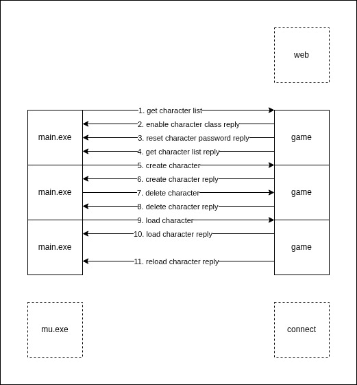

## Character



### Get Character List

#### Request

```
[C1 04 F3 00]
```

| Index | Element | Description                         |
| ----- | ------- | ----------------------------------- |
| 0     | 0xC1    | c1c2 frame flag                     |
| 1     | 0x04    | c1c2 frame size                     |
| 2     | 0xF3    | c1c2 frame code 0xF300 BE high byte |
| 3     | 0x00    | c1c2 frame code 0xF300 BE low byte  |

#### Reply Enable Character Class

```
[C1 05 DE 00 1F]
```

| Index | Element | Description                         |
| ----- | ------- | ----------------------------------- |
| 0     | 0xC1    | c1c2 frame flag                     |
| 1     | 0x05    | c1c2 frame size                     |
| 2     | 0xDE    | c1c2 frame code 0xF300 BE high byte |
| 3     | 0x00    | c1c2 frame code 0xF300 BE low byte  |
| 4     | 0x1F    | enable character class              |

```
character class:
0x01 - Summoner
0x02 - DarkLord
0x04 - Magumsa
0x08 - RageFighter
0x10 - GrowLancer
```

#### Reply Reset Character

```
pack(1)
[C1 n+4 FA 0A [n]byte]
```

| Index | Element | Description                         |
| ----- | ------- | ----------------------------------- |
| 0     | 0xC1    | c1c2 frame flag                     |
| 1     | n+4     | c1c2 frame size                     |
| 2     | 0xFA    | c1c2 frame code 0xFA0A BE high byte |
| 3     | 0x0A    | c1c2 frame code 0xFA0A BE low byte  |
| 4~n+3 | [n]byte | reset character password            |

#### Reply Get Character List

```
[C1 1C F3 00 1F 00 01 01 byte[36]]
```

| Index | Element  | Description                          |
| ----- | -------- | ------------------------------------ |
| 0     | 0xC1     | c1c2 frame flag                      |
| 1     | 0x1C     | c1c2 frame size                      |
| 2     | 0xF3     | c1c2 frame code 0xF300 BE high byte  |
| 3     | 0x00     | c1c2 frame code 0xF300 BE low byte   |
| 4     | 0x1F     | enable character class               |
| 5     | 0x00     | move count                           |
| 6     | 0x01     | character list count                 |
| 7     | 0x01     | warehouse expansion flag: 0=no 1=yes |
| 8~43  | [36]byte | character information                |

| Index | Element  | Character Description      |
| ----- | -------- | -------------------------- |
| 0     | 0x00     | index: 0~4                 |
| 1~10  | [10]byte | name                       |
| 11    | 0x00     | padding for alignment in C |
| 12    | 0x01     | level 0x0001 LE low byte   |
| 13    | 0x00     | level 0x0001 LE high byte  |
| 14    | 0x00     | ctlcode                    |
| 15~32 | byte[18] | character encode           |
| 33    | 0xFF     | guild status               |
| 34    | 0x00     | pk level                   |
| 35    | 0x00     | padding for alignment in C |

```
class -> chars[0] bit5~bit7: 0~7 bit3~bit4: 2=changeup1 3=changeup2

slot0~slot6 index -> chars[1]~chars[5]
slot0~slot6 index extention1 -> chars[9] bit3~bit7
slot0~slot6 index extention2 -> chars[12]~chars[15]

slot0~slot6 level -> chars[6]~chars[8]

slot7 -> chars[5] bit2~bit3 4=1D, 8=2D, 12=3D 0=empty
slot7 -> chars[9] bit0~bit2
slot7 -> chars[16] bit2~bit4

slot8 -> chars[5] bit0~bit1 0=守护天使 1=小恶魔 3=empty
slot8 -> chars[16] bit5~bit7 bit0~bit1

chars[17]
```

### Create Character

#### Request

```
pack(1)
[C1 0F F3 01 [10]byte 10]
```

| Index | Element  | Description                         |
| ----- | -------- | ----------------------------------- |
| 0     | 0xC1     | c1c2 frame flag                     |
| 1     | 0x0F     | c1c2 frame size                     |
| 2     | 0xF3     | c1c2 frame code 0xF301 BE high byte |
| 3     | 0x01     | c1c2 frame code 0xF301 BE low byte  |
| 4~13  | byte[10] | character name                      |
| 14    | 0x10     | character class                     |

```
character class:
0x00 - Dark Wizard
0x10 - Dark Knight
0x20 - Elf
0x30 - Magic Gladiator
0x40 - Dark Lord
0x50 - Summoner
0x60 - Rage Fighter
0x70 - GrowLancer
```

#### Reply

```
[C1 2C F3 01 01 byte[10] 00 01 00 10 byte[24] 00]
```

| Index | Element  | Description                         |
| ----- | -------- | ----------------------------------- |
| 0     | 0xC1     | c1c2 frame flag                     |
| 1     | 0x2C     | c1c2 frame size                     |
| 2     | 0xF3     | c1c2 frame code 0xF301 BE high byte |
| 3     | 0x01     | c1c2 frame code 0xF301 BE low byte  |
| 4     | 0x01     | result: 0=failed 1=success          |
| 5~14  | byte[10] | name                                |
| 15    | 0x00     | index                               |
| 16    | 0x01     | level 0x0001 LE low byte            |
| 17    | 0x00     | level 0x0001 LE high byte           |
| 18    | 0x10     | class bit5~bit7: 0~7                |
| 19~42 | byte[24] | equipment                           |
| 43    | 0x00     | padding for alignment in C          |

### Delete character

#### Request

```
pack(1)
[C1 15 F3 02 [10]byte [7]password]
```

| Index | Element  | Description                         |
| ----- | -------- | ----------------------------------- |
| 0     | 0xC1     | c1c2 frame flag                     |
| 1     | 0x15     | c1c2 frame size                     |
| 2     | 0xF3     | c1c2 frame code 0xF302 BE high byte |
| 3     | 0x02     | c1c2 frame code 0xF302 BE low byte  |
| 4~13  | [10]byte | character name                      |
| 14~20 | [7]byte  | reset password last 7 digits        |

#### Reply

```
[C1 05 F3 02 01]
```

| Index | Element | Description                                     |
| ----- | ------- | ----------------------------------------------- |
| 0     | 0xC1    | c1c2 frame flag                                 |
| 1     | 0x05    | c1c2 frame size                                 |
| 2     | 0xF3    | c1c2 frame code 0xF302 BE high byte             |
| 3     | 0x02    | c1c2 frame code 0xF302 BE low byte              |
| 4     | 0x01    | result: 0=failed 1=success 2=password unmatched |

### Load character

#### Request

```
pack(1)
[C1 0F F3 03 [10]byte 00]
```

| Index | Element  | Description                         |
| ----- | -------- | ----------------------------------- |
| 0     | 0xC1     | c1c2 frame flag                     |
| 1     | 0x15     | c1c2 frame size                     |
| 2     | 0xF3     | c1c2 frame code 0xF303 BE high byte |
| 3     | 0x03     | c1c2 frame code 0xF303 BE low byte  |
| 4~13  | [10]byte | character name                      |
| 14    | 0x00     | character position: 0~4             |

#### Reply

```
[C3 48 F3 03 ...]
```

| Index | Element | Description                              |
| ----- | ------- | ---------------------------------------- |
| 0     | 0xC3    | c1c2 frame flag                          |
| 1     | 0x48    | c1c2 frame size                          |
| 2     | 0xF3    | c1c2 frame code 0xF303 BE high byte      |
| 3     | 0x03    | c1c2 frame code 0xF303 BE low byte       |
| 4     | 0x01    | character coordinate x: 0~255            |
| 5     | 0x01    | character coordinate y: 0~255            |
| 6     | 0x01    | character map number                     |
| 7     | 0x05    | character direction: 0~7                 |
| 8~15  | [8]byte | character experience 64bit BE            |
| 16~23 | [8]byte | character next level experience 64bit BE |
| 24~25 | [2]byte | character level up point 16bit LE        |
| 26~27 | [2]byte | character strength 16bit LE              |
| 28~29 | [2]byte | character dexterity 16bit LE             |
| 30~31 | [2]byte | character vitality 16bit LE              |
| 32~33 | [2]byte | character energy 16bit LE                |
| 34~35 | [2]byte | character HP 16bit LE                    |
| 36~37 | [2]byte | character Max HP 16bit LE                |
| 38~39 | [2]byte | character MP 16bit LE                    |
| 40~41 | [2]byte | character Max MP 16bit LE                |
| 42~43 | [2]byte | character SD 16bit LE                    |
| 44~45 | [2]byte | character Max SD 16bit LE                |
| 46~47 | [2]byte | character BP 16bit LE                    |
| 48~49 | [2]byte | character Max BP 16bit LE                |
| 50~51 | [2]byte | padding for alignment in C               |
| 52~55 | [4]byte | character money                          |
| 56    | 0x00    | character pk level                       |
| 57    | 0x00    | character control code                   |
| 58~59 | [2]byte | character add point                      |
| 60~61 | [2]byte | character max add point                  |
| 62~63 | [2]byte | character leadership                     |
| 64~65 | [2]byte | character minus point                    |
| 66~67 | [2]byte | character max minus point                |
| 68~69 | [2]byte | character inventory expansion            |
| 70~71 | [2]byte | padding for alignment in C               |
