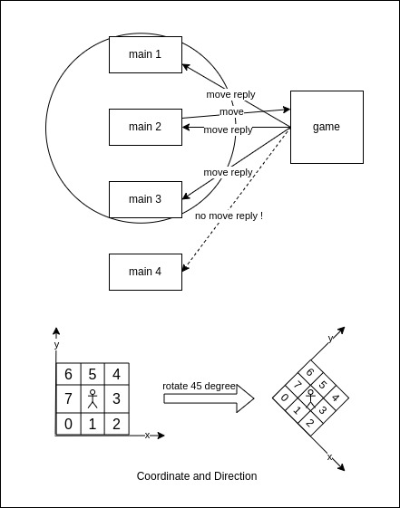
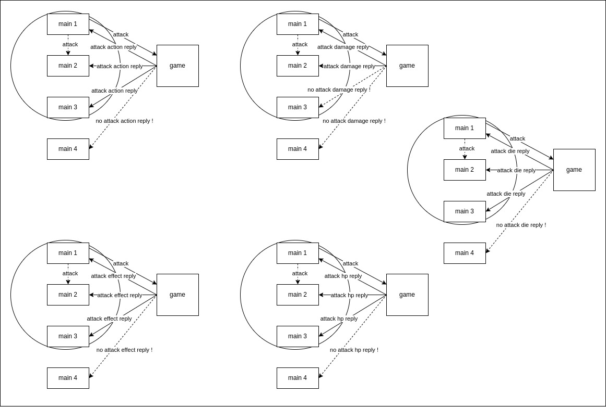
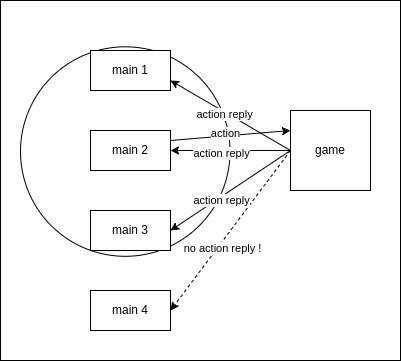

## Object

### 1. Move



#### Request

```
pack(1)
[C1 06+n D4 01 01 55 [n]byte]
```

| Index | Element | Description                                         |
| ----- | ------- | --------------------------------------------------- |
| 0     | 0xC1    | c1c2 frame flag                                     |
| 1     | 0x06+n  | c1c2 frame size                                     |
| 2     | 0xD4    | c1c2 frame code: 0xD7 (0xD4 for s9)                 |
| 3     | 0x01    | object current coordinate x: 0~255                  |
| 4     | 0x01    | object current coordinate y: 0~255                  |
| 5     | 0x55    | bit4~bit7: object current dir; bit0~bit3: path size |
| 6+n   | [n]byte | object move path                                    |

```
object move path:
path[0] bit4~bit7: the 1st dir
path[0] bit0~bit3: the 2nd dir
...
path[n] bit4~bit7: the 2n+1st dir
path[n] bit0~bit3: the 2n+2nd dir
...
path[7] bit4~bit7: the 15th dir
path[7] bit0~bit3: placeholder
```

#### Reply

```
pack(1)
[C1 08 D4 [2]byte 01 01 05]
```

| Index | Element | Description                         |
| ----- | ------- | ----------------------------------- |
| 0     | 0xC1    | c1c2 frame flag                     |
| 1     | 0x08    | c1c2 frame size                     |
| 2     | 0xD4    | c1c2 frame code: 0xD7 (0xD4 for s9) |
| 3~4   | [2]byte | object index BE                     |
| 5     | 0x01    | object target coordinate x: 0~255   |
| 6     | 0x01    | object target coordinate y: 0~255   |
| 7     | 0x05    | bit4~bit7: object current dir       |

#### Handle

1, Game Client launch move request to Game Server.

2, Once Game Server receives the request(move sync), it will save the path that object want to move to the specific object context and reply(move ack) with MsgMoveReply to all objects in the viewport, then execute the object move action with move state machine.

3, Once Game Client receives the reply(move ack), it has to render the object move action

### 2. Viewport

#### Request

empty

#### Handle

Game will process all objects viewport every 1 second.  
Game will add the target object to object viewport if the target is near from our object and push the increment-add viewport reply to client and it will remove the target object from our object viewport if it is too far away and also push the increment-remove viewport to client.

#### Reply create viewport player object

```
pack(1)
[C2 [2]byte 12 10 [n]player]
```

| Index | Element | Description        |
| ----- | ------- | ------------------ |
| 0     | 0xC2    | c1c2 frame flag    |
| 1~2   | [2]byte | c1c2 frame size BE |
| 3     | 0x12    | c1c2 frame code    |
| 4     | 0x10    | player count       |

| Index | Element  | Description                        |
| ----- | -------- | ---------------------------------- |
| 0~1   | [2]byte  | player index BE                    |
| 2     | 0x01     | player current coordinate x: 0~255 |
| 3     | 0x01     | player current coordinate y: 0~255 |
| 4~21  | [18]byte | player character frame             |
| 22~31 | [10]byte | name(GBK)                          |
| 32    | 0x01     | player target coordinate x: 0~255  |
| 33    | 0x01     | player target coordinate y: 0~255  |
| 34    | 0x05     | player current dir<<4 or pk level  |
| 35    | 0x00     | player pentagram main attribute    |
| 36~37 | [2]byte  | player muun item BE                |
| 38~39 | [2]byte  | player muun sub item BE            |
| 40~41 | [2]byte  | player muun ride item BE           |
| 42~43 | [2]byte  | player level BE                    |
| 44    | byte     | player maxhp>>24                   |
| 45    | byte     | player maxhp>>8                    |
| 46    | byte     | player maxhp>>16                   |
| 47    | byte     | player maxhp                       |
| 48    | byte     | player hp>>24                      |
| 49    | byte     | player hp>>8                       |
| 50    | byte     | player hp>>16                      |
| 51    | byte     | player hp                          |
| 52~53 | [2]byte  | server code LE                     |
| 54    | byte     | buff effects count                 |
| 54+n  | [n]byte  | buff effect item                   |

#### Reply create viewport monster object

```
pack(1)
[C2 [2]byte 13 10 [n]monster]
```

| Index | Element | Description        |
| ----- | ------- | ------------------ |
| 0     | 0xC2    | c1c2 frame flag    |
| 1~2   | [2]byte | c1c2 frame size BE |
| 3     | 0x13    | c1c2 frame code    |
| 4     | 0x10    | monster count      |

| Index | Element | Description                         |
| ----- | ------- | ----------------------------------- |
| 0~1   | [2]byte | monster index BE                    |
| 2~3   | [2]byte | monster class BE                    |
| 4     | 0x01    | monster current coordinate x: 0~255 |
| 5     | 0x01    | monster current coordinate y: 0~255 |
| 6     | 0x01    | monster target coordinate x: 0~255  |
| 7     | 0x01    | monster target coordinate y: 0~255  |
| 8     | 0x05    | monster current dir<<4              |
| 9     | 0x00    | monster pentagram main attribute    |
| 10~11 | [2]byte | monster level BE                    |
| 12    | byte    | monster maxhp>>24                   |
| 13    | byte    | monster maxhp>>8                    |
| 14    | byte    | monster maxhp>>16                   |
| 15    | byte    | monster maxhp                       |
| 16    | byte    | monster hp>>24                      |
| 17    | byte    | monster hp>>8                       |
| 18    | byte    | monster hp>>16                      |
| 19    | byte    | monster hp                          |
| 20    | byte    | buff effects count                  |
| 20+n  | [n]byte | buff effect item                    |

#### Reply destroy viewport object

```
pack(1)
[C1 24 14 10 [n]object]
```

| Index | Element | Description     |
| ----- | ------- | --------------- |
| 0     | 0xC1    | c1c2 frame flag |
| 1     | 0x24    | c1c2 frame size |
| 2     | 0x14    | c1c2 frame code |
| 3     | 0x10    | object count    |

| Index | Element | Description     |
| ----- | ------- | --------------- |
| 0~1   | [2]byte | object index BE |

### 3. Attack



#### Request

```
pack(1)
[C1 07 11 [2]byte 78 05]
```

| Index | Element | Description            |
| ----- | ------- | ---------------------- |
| 0     | 0xC1    | c1c2 frame flag        |
| 1     | 0x07    | c1c2 frame size        |
| 2     | 0x11    | c1c2 frame code 0x11   |
| 3~4   | [2]byte | target object index BE |
| 5     | 0x78    | action                 |
| 6     | 0x05    | attack direction       |

#### Handle

Game will execute the attack instruction and push reply to object viewport.

#### Reply action

```
pack(1)
[C1 09 18 [2]byte 05 78 [2]byte]
```

| Index | Element | Description     |
| ----- | ------- | --------------- |
| 0     | 0xC1    | c1c2 frame flag |
| 1     | 0x09    | c1c2 frame size |
| 2     | 0x18    | c1c2 frame code |
| 3~4   | [2]byte | object index BE |
| 5     | 0x05    | direction       |
| 6     | 0x78    | action          |
| 7~8   | [2]byte | target index BE |

#### Reply attack damage

```
pack(1)
[C1 0B 11 [2]byte [2]byte [2]byte [2]byte]
```

| Index | Element | Description     |
| ----- | ------- | --------------- |
| 0     | 0xC1    | c1c2 frame flag |
| 1     | 0x0B    | c1c2 frame size |
| 2     | 0x11    | c1c2 frame code |
| 3~4   | [2]byte | target index BE |
| 5~6   | [2]byte | damage BE       |
| 7~8   | [2]byte | damage type BE  |
| 9~10  | [2]byte | SD damage BE    |

#### Reply attack effect

```
pack(1)
[C1 12 FA 05 [2]byte [4]byte [4]byte [2]byte 00 00]
```

| Index | Element | Description        |
| ----- | ------- | ------------------ |
| 0     | 0xC1    | c1c2 frame flag    |
| 1     | 0x12    | c1c2 frame size    |
| 2~3   | 0xFA05  | c1c2 frame code BE |
| 4~5   | [2]byte | target index LE    |
| 6~9   | [4]byte | target hp LE       |
| 10~13 | [4]byte | target max hp LE   |
| 14~15 | [2]byte | target level LE    |
| 16    | 0x00    | ice effect         |
| 17    | 0x00    | poison effect      |

#### Reply attack hp

```
pack(1)
[C1 0D EC 10 [2]byte [4]byte [4]byte]
```

| Index | Element | Description        |
| ----- | ------- | ------------------ |
| 0     | 0xC1    | c1c2 frame flag    |
| 1     | 0x0D    | c1c2 frame size    |
| 2~3   | 0xEC10  | c1c2 frame code BE |
| 4~5   | [2]byte | target index BE    |
| 6     | byte    | monster maxhp>>24  |
| 7     | byte    | monster maxhp>>8   |
| 8     | byte    | monster maxhp>>16  |
| 9     | byte    | monster maxhp      |
| 10    | byte    | monster hp>>24     |
| 11    | byte    | monster hp>>8      |
| 12    | byte    | monster hp>>16     |
| 13    | byte    | monster hp         |

#### Reply attack die

```
pack(1)
[C1 08 17 [2]byte 00 [2]byte]
```

| Index | Element | Description        |
| ----- | ------- | ------------------ |
| 0     | 0xC1    | c1c2 frame flag    |
| 1     | 0x08    | c1c2 frame size    |
| 2     | 0x17    | c1c2 frame code BE |
| 3~4   | [2]byte | target index BE    |
| 5     | 0x00    | skill              |
| 6~7   | [2]byte | object index BE    |

### 4. Action



#### Request

```
pack(1)
[C1 05 18 7A 05]
```

| Index | Element | Description      |
| ----- | ------- | ---------------- |
| 0     | 0xC1    | c1c2 frame flag  |
| 1     | 0x05    | c1c2 frame size  |
| 2     | 0x18    | c1c2 frame code  |
| 3     | 0x7A    | action           |
| 4     | 0x05    | attack direction |

#### Reply

```
pack(1)
[C1 09 18 [2]byte 05 7A [2]byte]
```

| Index | Element | Description           |
| ----- | ------- | --------------------- |
| 0     | 0xC1    | c1c2 frame flag       |
| 1     | 0x09    | c1c2 frame size       |
| 2     | 0x18    | c1c2 frame code       |
| 3~4   | [2]byte | object index index BE |
| 5     | 0x05    | direction             |
| 6     | 0x7A    | action                |
| 7~8   | [2]byte | object index index BE |
