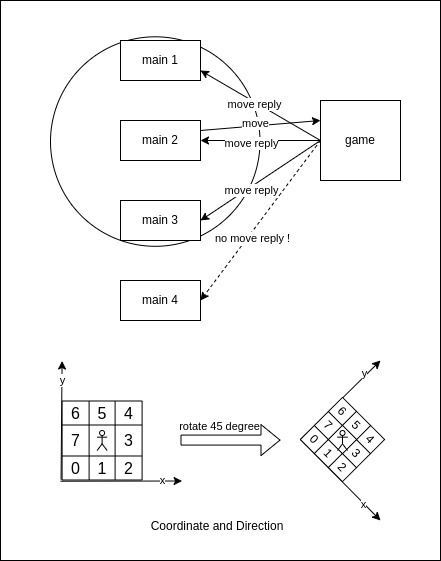
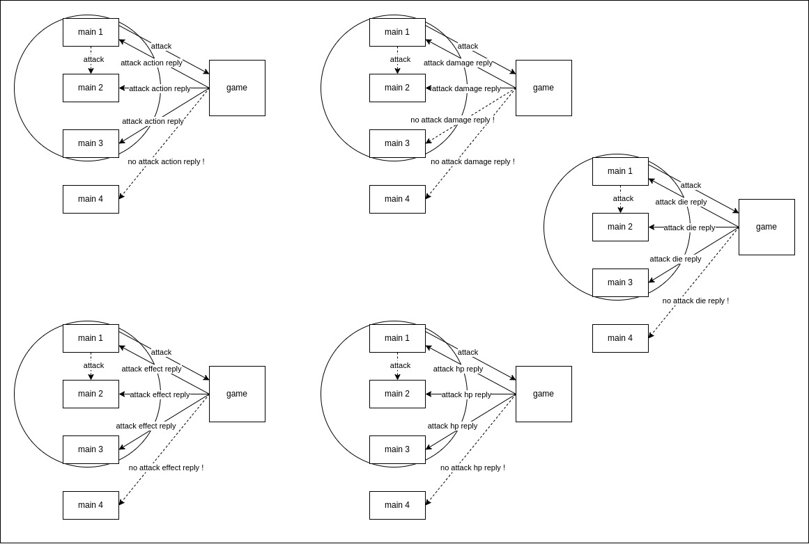
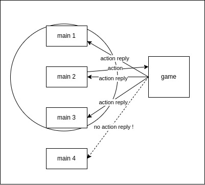
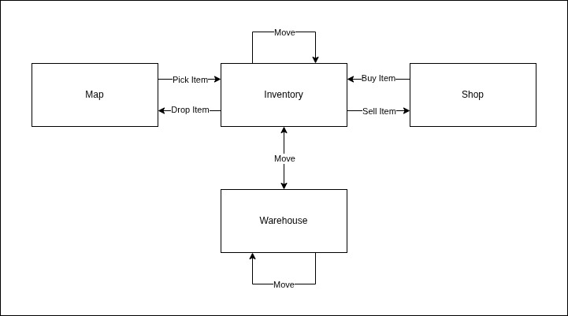

## Object

Object Move/Viewport/Attack/Action/Item/Skill

### 1. Move



#### Move Request

```
pack(1)
[C1 06+n D4 01 01 55 [n]byte]
```

| Index | Element | Description                                         |
| ----- | ------- | --------------------------------------------------- |
| 0     | 0xC1    | c1c2 frame flag                                     |
| 1     | 0x06+n  | c1c2 frame size                                     |
| 2     | 0xD4    | c1c2 frame code: 0xD7 (0xD4 for s9)                 |
| 3     | 0x01    | object current coordinate x: 0~255                  |
| 4     | 0x01    | object current coordinate y: 0~255                  |
| 5     | 0x55    | bit4~bit7: object current dir; bit0~bit3: path size |
| 6+n   | [n]byte | object move path                                    |

```
object move path:
path[0] bit4~bit7: the 1st dir
path[0] bit0~bit3: the 2nd dir
...
path[n] bit4~bit7: the 2n+1st dir
path[n] bit0~bit3: the 2n+2nd dir
...
path[7] bit4~bit7: the 15th dir
path[7] bit0~bit3: placeholder
```

#### Move Reply

```
pack(1)
[C1 08 D4 [2]byte 01 01 05]
```

| Index | Element | Description                         |
| ----- | ------- | ----------------------------------- |
| 0     | 0xC1    | c1c2 frame flag                     |
| 1     | 0x08    | c1c2 frame size                     |
| 2     | 0xD4    | c1c2 frame code: 0xD7 (0xD4 for s9) |
| 3~4   | [2]byte | object index BE                     |
| 5     | 0x01    | object target coordinate x: 0~255   |
| 6     | 0x01    | object target coordinate y: 0~255   |
| 7     | 0x05    | bit4~bit7: object current dir       |

#### Move Handle

1, Game Client launch move request to Game Server.

2, Once Game Server receives the request(move sync), it will save the path that object want to move to the specific object context and reply(move ack) with MsgMoveReply to all objects in the viewport, then execute the object move action with move state machine.

3, Once Game Client receives the reply(move ack), it has to render the object move action

#### Teleport Request

#### Teleport Reply

#### Map Move Request

#### Map Move Reply

### 2. Viewport

#### Request

empty

#### Handle

Game will process all objects viewport every 1 second.  
Game will add the target object to object viewport if the target is near from our object and push the increment-add viewport reply to client and it will remove the target object from our object viewport if it is too far away and also push the increment-remove viewport to client.

#### Create Viewport Player Reply

```
pack(1)
[C2 [2]byte 12 10 [n]player]
```

| Index | Element | Description        |
| ----- | ------- | ------------------ |
| 0     | 0xC2    | c1c2 frame flag    |
| 1~2   | [2]byte | c1c2 frame size BE |
| 3     | 0x12    | c1c2 frame code    |
| 4     | 0x10    | player count       |

| Index | Element  | Description                        |
| ----- | -------- | ---------------------------------- |
| 0~1   | [2]byte  | player index BE                    |
| 2     | 0x01     | player current coordinate x: 0~255 |
| 3     | 0x01     | player current coordinate y: 0~255 |
| 4~21  | [18]byte | player character frame             |
| 22~31 | [10]byte | name(GBK)                          |
| 32    | 0x01     | player target coordinate x: 0~255  |
| 33    | 0x01     | player target coordinate y: 0~255  |
| 34    | 0x05     | player current dir<<4 or pk level  |
| 35    | 0x00     | player pentagram main attribute    |
| 36~37 | [2]byte  | player muun item BE                |
| 38~39 | [2]byte  | player muun sub item BE            |
| 40~41 | [2]byte  | player muun ride item BE           |
| 42~43 | [2]byte  | player level BE                    |
| 44    | byte     | player maxhp>>24                   |
| 45    | byte     | player maxhp>>8                    |
| 46    | byte     | player maxhp>>16                   |
| 47    | byte     | player maxhp                       |
| 48    | byte     | player hp>>24                      |
| 49    | byte     | player hp>>8                       |
| 50    | byte     | player hp>>16                      |
| 51    | byte     | player hp                          |
| 52~53 | [2]byte  | server code LE                     |
| 54    | byte     | buff effects count                 |
| 54+n  | [n]byte  | buff effect item                   |

#### Create Viewport Monster Reply

```
pack(1)
[C2 [2]byte 13 10 [n]monster]
```

| Index | Element | Description        |
| ----- | ------- | ------------------ |
| 0     | 0xC2    | c1c2 frame flag    |
| 1~2   | [2]byte | c1c2 frame size BE |
| 3     | 0x13    | c1c2 frame code    |
| 4     | 0x10    | monster count      |

| Index | Element | Description                         |
| ----- | ------- | ----------------------------------- |
| 0~1   | [2]byte | monster index BE                    |
| 2~3   | [2]byte | monster class BE                    |
| 4     | 0x01    | monster current coordinate x: 0~255 |
| 5     | 0x01    | monster current coordinate y: 0~255 |
| 6     | 0x01    | monster target coordinate x: 0~255  |
| 7     | 0x01    | monster target coordinate y: 0~255  |
| 8     | 0x05    | monster current dir<<4              |
| 9     | 0x00    | monster pentagram main attribute    |
| 10~11 | [2]byte | monster level BE                    |
| 12    | byte    | monster maxhp>>24                   |
| 13    | byte    | monster maxhp>>8                    |
| 14    | byte    | monster maxhp>>16                   |
| 15    | byte    | monster maxhp                       |
| 16    | byte    | monster hp>>24                      |
| 17    | byte    | monster hp>>8                       |
| 18    | byte    | monster hp>>16                      |
| 19    | byte    | monster hp                          |
| 20    | byte    | buff effects count                  |
| 20+n  | [n]byte | buff effect item                    |

#### Create Viewport Item Reply

#### Destroy Viewport Object Reply

```
pack(1)
[C1 24 14 10 [n]object]
```

| Index | Element | Description     |
| ----- | ------- | --------------- |
| 0     | 0xC1    | c1c2 frame flag |
| 1     | 0x24    | c1c2 frame size |
| 2     | 0x14    | c1c2 frame code |
| 3     | 0x10    | object count    |

| Index | Element | Description     |
| ----- | ------- | --------------- |
| 0~1   | [2]byte | object index BE |

### 3. Attack



#### Attack Request

```
pack(1)
[C1 07 11 [2]byte 78 05]
```

| Index | Element | Description            |
| ----- | ------- | ---------------------- |
| 0     | 0xC1    | c1c2 frame flag        |
| 1     | 0x07    | c1c2 frame size        |
| 2     | 0x11    | c1c2 frame code 0x11   |
| 3~4   | [2]byte | target object index BE |
| 5     | 0x78    | action                 |
| 6     | 0x05    | attack direction       |

#### Attack Handle

Game will execute the attack instruction and push reply to object viewport.

#### Attack Action Reply

```
pack(1)
[C1 09 18 [2]byte 05 78 [2]byte]
```

| Index | Element | Description     |
| ----- | ------- | --------------- |
| 0     | 0xC1    | c1c2 frame flag |
| 1     | 0x09    | c1c2 frame size |
| 2     | 0x18    | c1c2 frame code |
| 3~4   | [2]byte | object index BE |
| 5     | 0x05    | direction       |
| 6     | 0x78    | action          |
| 7~8   | [2]byte | target index BE |

#### Attack Damage Reply

```
pack(1)
[C1 0B 11 [2]byte [2]byte [2]byte [2]byte]
```

| Index | Element | Description     |
| ----- | ------- | --------------- |
| 0     | 0xC1    | c1c2 frame flag |
| 1     | 0x0B    | c1c2 frame size |
| 2     | 0x11    | c1c2 frame code |
| 3~4   | [2]byte | target index BE |
| 5~6   | [2]byte | damage BE       |
| 7~8   | [2]byte | damage type BE  |
| 9~10  | [2]byte | SD damage BE    |

#### Attack Effect Reply

```
pack(1)
[C1 12 FA 05 [2]byte [4]byte [4]byte [2]byte 00 00]
```

| Index | Element | Description        |
| ----- | ------- | ------------------ |
| 0     | 0xC1    | c1c2 frame flag    |
| 1     | 0x12    | c1c2 frame size    |
| 2~3   | 0xFA05  | c1c2 frame code BE |
| 4~5   | [2]byte | target index LE    |
| 6~9   | [4]byte | target hp LE       |
| 10~13 | [4]byte | target max hp LE   |
| 14~15 | [2]byte | target level LE    |
| 16    | 0x00    | ice effect         |
| 17    | 0x00    | poison effect      |

#### Attack HP Reply

```
pack(1)
[C1 0D EC 10 [2]byte [4]byte [4]byte]
```

| Index | Element | Description        |
| ----- | ------- | ------------------ |
| 0     | 0xC1    | c1c2 frame flag    |
| 1     | 0x0D    | c1c2 frame size    |
| 2~3   | 0xEC10  | c1c2 frame code BE |
| 4~5   | [2]byte | target index BE    |
| 6     | byte    | monster maxhp>>24  |
| 7     | byte    | monster maxhp>>8   |
| 8     | byte    | monster maxhp>>16  |
| 9     | byte    | monster maxhp      |
| 10    | byte    | monster hp>>24     |
| 11    | byte    | monster hp>>8      |
| 12    | byte    | monster hp>>16     |
| 13    | byte    | monster hp         |

#### Attack Die Reply

```
pack(1)
[C1 08 17 [2]byte 00 [2]byte]
```

| Index | Element | Description        |
| ----- | ------- | ------------------ |
| 0     | 0xC1    | c1c2 frame flag    |
| 1     | 0x08    | c1c2 frame size    |
| 2     | 0x17    | c1c2 frame code BE |
| 3~4   | [2]byte | target index BE    |
| 5     | 0x00    | skill              |
| 6~7   | [2]byte | object index BE    |

### 4. Action



#### Request

```
pack(1)
[C1 05 18 7A 05]
```

| Index | Element | Description      |
| ----- | ------- | ---------------- |
| 0     | 0xC1    | c1c2 frame flag  |
| 1     | 0x05    | c1c2 frame size  |
| 2     | 0x18    | c1c2 frame code  |
| 3     | 0x7A    | action           |
| 4     | 0x05    | attack direction |

#### Reply

```
pack(1)
[C1 09 18 [2]byte 05 7A [2]byte]
```

| Index | Element | Description           |
| ----- | ------- | --------------------- |
| 0     | 0xC1    | c1c2 frame flag       |
| 1     | 0x09    | c1c2 frame size       |
| 2     | 0x18    | c1c2 frame code       |
| 3~4   | [2]byte | object index index BE |
| 5     | 0x05    | direction             |
| 6     | 0x7A    | action                |
| 7~8   | [2]byte | object index index BE |

### 5. Item



#### Pick Item

#### Drop Item

#### Buy Item

#### Sell Item

#### Move Item

##### Request

```
pack(1)
[C1 13 24 byte byte [12]byte byte byte]
```

| Index | Element  | Description          |
| ----- | -------- | -------------------- |
| 0     | 0xC1     | c1c2 frame flag      |
| 1     | 0x13     | c1c2 frame size      |
| 2     | 0x24     | c1c2 frame code      |
| 3     | byte     | source flag          |
| 4     | byte     | source position      |
| 5~16  | [12]byte | item frame           |
| 17    | byte     | destination flag     |
| 18    | byte     | destination position |

##### Reply

```
pack(1)
[C3 11 24 byte byte [12]byte]
```

| Index | Element  | Description                 |
| ----- | -------- | --------------------------- |
| 0     | 0xC1     | c1c2 frame flag             |
| 1     | 0x11     | c1c2 frame size             |
| 2     | 0x24     | c1c2 frame code             |
| 3     | byte     | result: 0=success -1=failed |
| 4     | byte     | destination position        |
| 5~16  | [12]byte | item frame                  |

#### Use Item

#### Repair Item

### 6. Skill

#### Use Skill Request

```
pack(1)
[C1 07 19 byte byte byte byte]
```

| Index | Element | Description              |
| ----- | ------- | ------------------------ |
| 0     | 0xC1    | c1c2 frame flag          |
| 1     | 0x07    | c1c2 frame size          |
| 2     | 0x19    | c1c2 frame code          |
| 3     | byte    | target object index high |
| 4     | byte    | skill index high         |
| 5     | byte    | target object index low  |
| 6     | byte    | skill index low          |

Target and skill are encoded as BE values with high/low bytes interleaved.

#### Use Skill Reply

```
pack(1)
[C3 09 19 [2]byte [2]byte [2]byte]
```

| Index | Element | Description                           |
| ----- | ------- | ------------------------------------- |
| 0     | 0xC3    | c1c2 frame flag                       |
| 1     | 0x09    | c1c2 frame size                       |
| 2     | 0x19    | c1c2 frame code                       |
| 3~4   | [2]byte | caster object index BE                |
| 5~6   | [2]byte | skill index BE                        |
| 7~8   | [2]byte | target object index BE; bit15=success |

#### Use Skill Duration Request

```
pack(1)
[C1 0D 1E byte byte byte byte byte byte byte byte byte byte]
```

| Index | Element | Description              |
| ----- | ------- | ------------------------ |
| 0     | 0xC1    | c1c2 frame flag          |
| 1     | 0x0D    | c1c2 frame size          |
| 2     | 0x1E    | c1c2 frame code          |
| 3     | byte    | start coordinate x       |
| 4     | byte    | skill index high         |
| 5     | byte    | start coordinate y       |
| 6     | byte    | skill index low          |
| 7     | byte    | direction                |
| 8     | byte    | target object index high |
| 9     | byte    | distance                 |
| 10    | byte    | target object index low  |
| 11    | byte    | target position          |
| 12    | byte    | magic key                |

#### Use Skill Duration Reply

```
pack(1)
[C3 0A 1E byte byte byte byte byte byte byte]
```

| Index | Element | Description              |
| ----- | ------- | ------------------------ |
| 0     | 0xC3    | c1c2 frame flag          |
| 1     | 0x0A    | c1c2 frame size          |
| 2     | 0x1E    | c1c2 frame code          |
| 3     | byte    | target coordinate x      |
| 4     | byte    | target coordinate y      |
| 5     | byte    | direction                |
| 6     | byte    | skill index high         |
| 7     | byte    | caster object index high |
| 8     | byte    | skill index low          |
| 9     | byte    | caster object index low  |

#### Use Skill Attack Multi Target Request

```
pack(1)
[C1 09+3n 1D byte n byte byte byte byte [3n]byte]
[C1 09+3n DF byte n byte byte byte byte [3n]byte]
```

| Index | Element  | Description              |
| ----- | -------- | ------------------------ |
| 0     | 0xC1     | c1c2 frame flag          |
| 1     | 0x09+3n  | c1c2 frame size          |
| 2     | 0x1D/DF  | c1c2 frame code          |
| 3     | byte     | skill index high         |
| 4     | n        | target count             |
| 5     | byte     | skill index low          |
| 6     | byte     | start coordinate x       |
| 7     | byte     | serial                   |
| 8     | byte     | start coordinate y       |
| 9~8+3n | [3n]byte | target high, magic key, target low |

Game Server accepts both `0x1D` and `0xDF` for multi target duration skill hits, and processes at most 5 targets.

#### Skill Handle

1, `UseSkill` validates target object, live state, map, learned skill, MP/AG, distance, and skill delay.

2, If the skill succeeds, Game Server subtracts MP/AG, records skill use time, and pushes skill reply to the caster viewport.

3, Duration skills must start with `UseSkillDuration`. The start packet stores duration skill state and pushes duration reply to the viewport.

4, `UseSkillAttackMultiTarget` is accepted only after matching duration skill state exists. The state expires after 8 seconds and accepts at most 5 packets, with at most 5 targets per packet.
