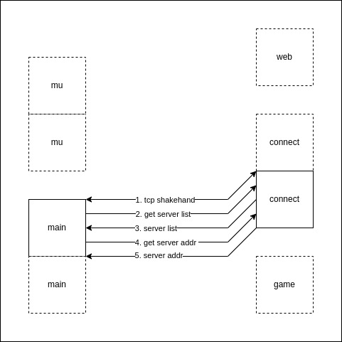

## Server List



### Game server Register

Game server send UDP register heartbeat message to Connect server.  
Interval 1s and timeout is 5s.

#### Request

```
[C1 08 01 00 00 00 30 00]
```

| Index | Element | Description                     |
| ----- | ------- | ------------------------------- |
| 0     | 0xC1    | c1c2 frame flag                 |
| 1     | 0x08    | c1c2 frame size                 |
| 2     | 0x01    | c1c2 frame code                 |
| 3     | 0x00    | placeholder for alignment in C  |
| 4     | 0x00    | server code 0x0000 LE low byte  |
| 5     | 0x00    | server code 0x0000 LE high byte |
| 6     | 0x30    | server percent 48%              |
| 7     | 0x00    | server type is pvp              |

```
[C1 08 01 00 01 00 40 01]
```

| Index | Element | Description                     |
| ----- | ------- | ------------------------------- |
| 0     | 0xC1    | c1c2 frame flag                 |
| 1     | 0x08    | c1c2 frame size                 |
| 2     | 0x01    | c1c2 frame code                 |
| 3     | 0x00    | placeholder for alignment in C  |
| 4     | 0x01    | server code 0x0001 LE low byte  |
| 5     | 0x00    | server code 0x0001 LE high byte |
| 6     | 0x40    | server percent 64%              |
| 7     | 0x01    | server type is non-pvp          |

#### Reply

Empty

### Get Game server list

#### Request

```
[C1 04 F4 06]
```

| Index | Element | Description                         |
| ----- | ------- | ----------------------------------- |
| 0     | 0xC1    | c1c2 frame flag                     |
| 1     | 0x04    | c1c2 frame size                     |
| 2     | 0xF4    | c1c2 frame code 0xF406 BE high byte |
| 3     | 0x06    | c1c2 frame code 0xF406 BE low byte  |

#### Reply

```
pack(1)
[C2 00 0F F4 06 00 02 00 00 30 00 01 00 40 01]
```

| Index | Element | Description                                  |
| ----- | ------- | -------------------------------------------- |
| 0     | 0xC2    | c1c2 frame flag                              |
| 1     | 0x00    | c1c2 frame size 0x000F BE high byte          |
| 2     | 0x0F    | c1c2 frame size 0x000F BE low byte           |
| 3     | 0xF4    | c1c2 frame code 0xF406 BE high byte          |
| 4     | 0x06    | c1c2 frame code 0xF406 BE low byte           |
| 5     | 0x00    | server list array length 0x0002 BE high byte |
| 6     | 0x02    | server list array length 0x0002 BE low byte  |
| 7     | 0x00    | server code 0x0000 LE low byte               |
| 8     | 0x00    | server code 0x0000 LE high byte              |
| 9     | 0x30    | server percent 48%                           |
| 10    | 0x00    | server type is pvp                           |
| 11    | 0x01    | server code 0x0001 LE low byte               |
| 12    | 0x00    | server code 0x0001 LE high byte              |
| 13    | 0x40    | server percent 64%                           |
| 14    | 0x01    | server type is non-pvp                       |

### Get Game server

#### Request

```
[C1 06 F4 03 01 00]
```

| Index | Element | Description                         |
| ----- | ------- | ----------------------------------- |
| 0     | 0xC1    | c1c2 frame flag                     |
| 1     | 0x06    | c1c2 frame size                     |
| 2     | 0xF4    | c1c2 frame code 0xF403 BE high byte |
| 3     | 0x03    | c1c2 frame code 0xF403 BE low byte  |
| 4     | 0x01    | server code 0x0001 LE low byte      |
| 5     | 0x00    | server code 0x0001 LE high byte     |

#### Reply

```
[C1 16 F4 03 ip[16] 45 DE]
```

| Index | Element | Description                                      |
| ----- | ------- | ------------------------------------------------ |
| 0     | 0xC1    | c1c2 frame flag                                  |
| 1     | 0x16    | c1c2 frame size                                  |
| 2     | 0xF4    | c1c2 frame code 0xF403 BE high byte              |
| 3     | 0x03    | c1c2 frame code 0xF403 BE low byte               |
| 4~19  | ip[16]  | server ip 16 bytes padding extra bytes with 0x00 |
| 20    | 0x45    | server port 56901(0xDE45) LE low byte            |
| 21    | 0xDE    | server port 56901(0xDE45) LE high byte           |
