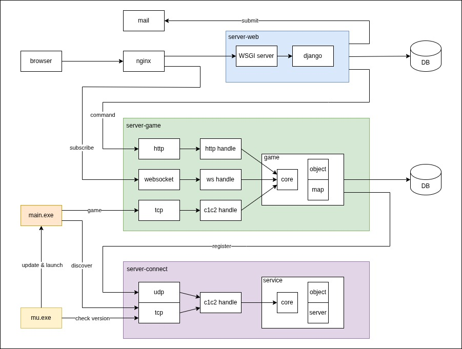

## System



### hold ubuntu 22.04.4

```
linux-generic-hwe-22.04
 ├── linux-image-generic-hwe-22.04
 │    └── linux-image-6.5.0-18-generic
 └── linux-headers-generic-hwe-22.04
      └── linux-headers-6.5.0-18-generic
```

```
pi@k65:~$ sudo apt-mark hold linux-image-generic-hwe-22.04 linux-headers-generic-hwe-22.04 linux-generic-hwe-22.04
linux-image-generic-hwe-22.04 set on hold.
linux-headers-generic-hwe-22.04 set on hold.
linux-generic-hwe-22.04 set on hold.

pi@k65:~$ sudo apt-mark hold linux-image-6.5.0-18-generic linux-headers-6.5.0-18-generic
linux-image-6.5.0-18-generic set on hold.
linux-headers-6.5.0-18-generic set on hold.

pi@k65:~$ apt-mark showhold
linux-generic-hwe-22.04
linux-headers-6.5.0-18-generic
linux-headers-generic-hwe-22.04
linux-image-6.5.0-18-generic
linux-image-generic-hwe-22.04
```

### dummy interface

```
# add dummy interface
ip link add dummy0 type dummy
ip addr add 10.1.2.3/24 dev dummy0
```

```
# delete dummy interface
ip link delete dummy0
```
