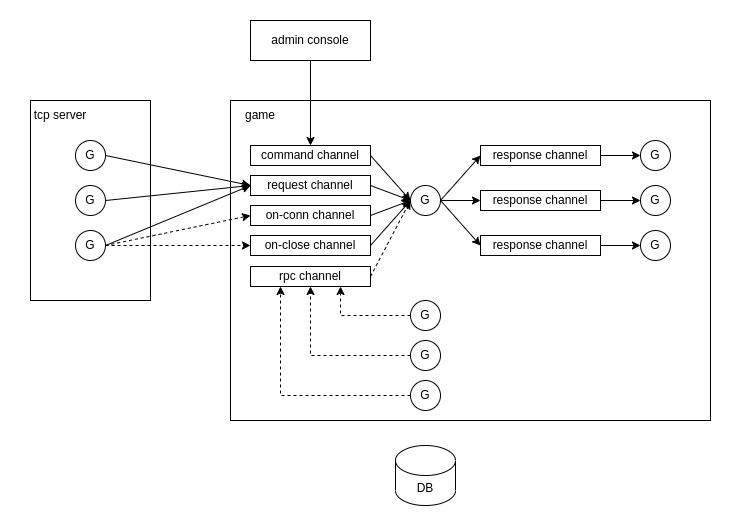

# server_game

## Diagram



## Debug

### .vscode/launch.json

```
{
    // Use IntelliSense to learn about possible attributes.
    // Hover to view descriptions of existing attributes.
    // For more information, visit: https://go.microsoft.com/fwlink/?linkid=830387
    "version": "0.2.0",
    "configurations": [
        {
            "name": "Launch Package",
            "type": "go",
            "request": "launch",
            "mode": "auto",
            "program": "${fileDirname}",
            "env": {
                "CONFIG_PATH": "${env:HOME}/balgass/config/server_game",
                "COMMON_PATH": "${env:HOME}/balgass/config/server_game_common",
                "DEBUG": "1"
            }
        }
    ]
}
```
